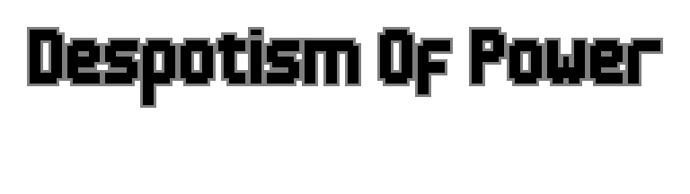
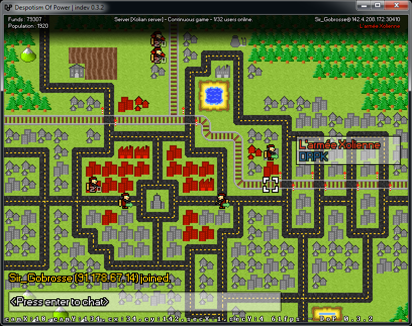

# Despotism of Power / XolioWars

## What in the hell is this

An old game project of mine from 2014, back when I was naive enough to believe I could make a proper indie game while barely out of high school. This ended up being just a shitty advance wars ripoff, but I still like the idea of an online, real-time advance-wars hommage. This codebase is beyond saving though for me, but maybe it can help someone.

## How do I build ? Why are there no git logs ? What's up with the code quality ?

Did I tell you I was young and naive ? 

Back then I didn't use Git. Or a build system. Let alone a formatting tool, or even a style guide. I used *Eclipse*, and that was it. Building is a matter of exporting the project to a JAR, the librairies are bundled with the code. In some ways I like this way of doing things better; you don't need the Internet everytime you need a build, just your IDE and a copy of the source.

## What's the license ? Can I take [x] ?

Tricky one that. I've been putting off releasing this for years because I would have needed to check for any copy/pasted snippet without credit, and misused licenses. I figured I will just upload this junk away and link it from my website, if this inspire someone to make their own game or my ugly art is of any use, then mission accomplished.

I don't care about anything in here, as long as I made it, it's yours to use: textures, code, even the game's name ( I can find something better if I ever do come back to this concept )